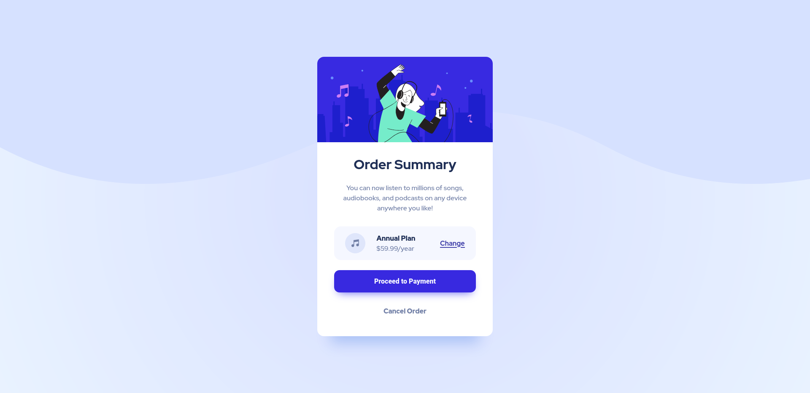

# Frontend Mentor - Order summary card solution

This is a solution to the [Order summary card challenge on Frontend Mentor](https://www.frontendmentor.io/challenges/order-summary-component-QlPmajDUj). Frontend Mentor challenges help you improve your coding skills by building realistic projects. 

## Table of contents

- [Overview](#overview)
  - [The challenge](#the-challenge)
  - [Screenshot](#screenshot)
  - [Links](#links)
- [My process](#my-process)
  - [Built with](#built-with)
  - [What I learned](#what-i-learned)
  - [Continued development](#continued-development)
  - [Useful resources](#useful-resources)
- [Author](#author)
- [Acknowledgments](#acknowledgments)

**Note: Delete this note and update the table of contents based on what sections you keep.**

## Overview

Created this project with help HTML and CSS only.

### The challenge

Users should be able to:

- See hover states for interactive elements

### Screenshot





### Links

- Solution URL: [Add solution URL here](https://github.com/kumarmash/order-summary-card)
- Live Site URL: [Add live site URL here](https://kumarmash.github.io/order-summary-card/)

## My process

### Built with

- Semantic HTML5 markup
- CSS custom properties
- Flexbox
- Mobile-first workflow

### What I learned

1) Learned about how to set images as background and manipulating it based on different screen-sizes.
2) learned more about @media queries and responsive design using flex boxes.


To see how you can add code snippets, see below:

```css
body {
  margin: 0;
  min-height: 100vh;
  font-family: "Red Hat Display", sans-serif;
  background: url(../images/pattern-background-desktop.svg) repeat-x, radial-gradient(circle, rgb(216 223 255), rgba(216, 233, 255, 0.57));
  background-repeat: repeat-x;
  line-height: 1.5em;
  font-size: 1em;
  display: flex;
  justify-content: center;
  align-items: center;
  color: hsl(224, 23%, 55%);
}
```


### Continued development

My next target is to learn about CSS Grids and Javascript for adding functionality to these pages


### Useful resources

## Author

- Website - [Manish Kumar](coming soon)
- Frontend Mentor - [@kumarmash](https://www.frontendmentor.io/profile/kumarmash)


## Acknowledgments
Thanks to frontend mentor team.